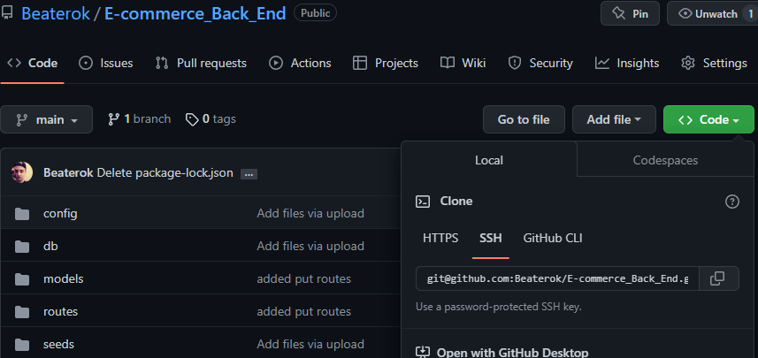
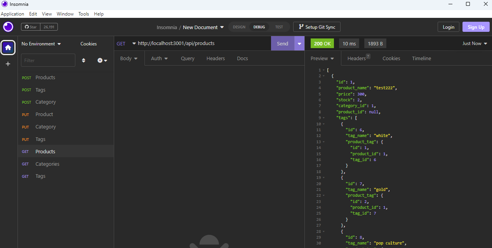

# E-Comers_Back_End
# Description
creating a back end for simple comers website using routes and modules 
# Installation
In order to view the code for my project, please visit https://github.com/Beaterok/E-commerce_Back_End . From there you will want to click on the green "code" button. Then you will need to copy the HTTPS link.

From there you will need to open your terminal on your computer and type "git clone "https://github.com/Beaterok/Schedule-Blocks.git". Then type "CD Portfolio". Then type "Code ."

Below is a screen shot example of the website as well as the github repository.
"scr"

# Usage
You can copy my repository https://github.com/Beaterok/E-commerce_Back_End. Then you can run all the insalls and create .env file and run the server where then you can run isomnia and be able to test out each route on my project

# Credits
Alexander Loburev. Jake Vanduyn.

# License
none

# Features
being able to update,create, and get products and their tags and categories.

# How to Contribute
You can also view the git repo at "https://github.com/Beaterok/E-commerce_Back_End"